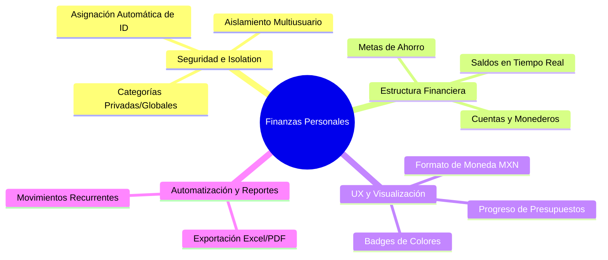
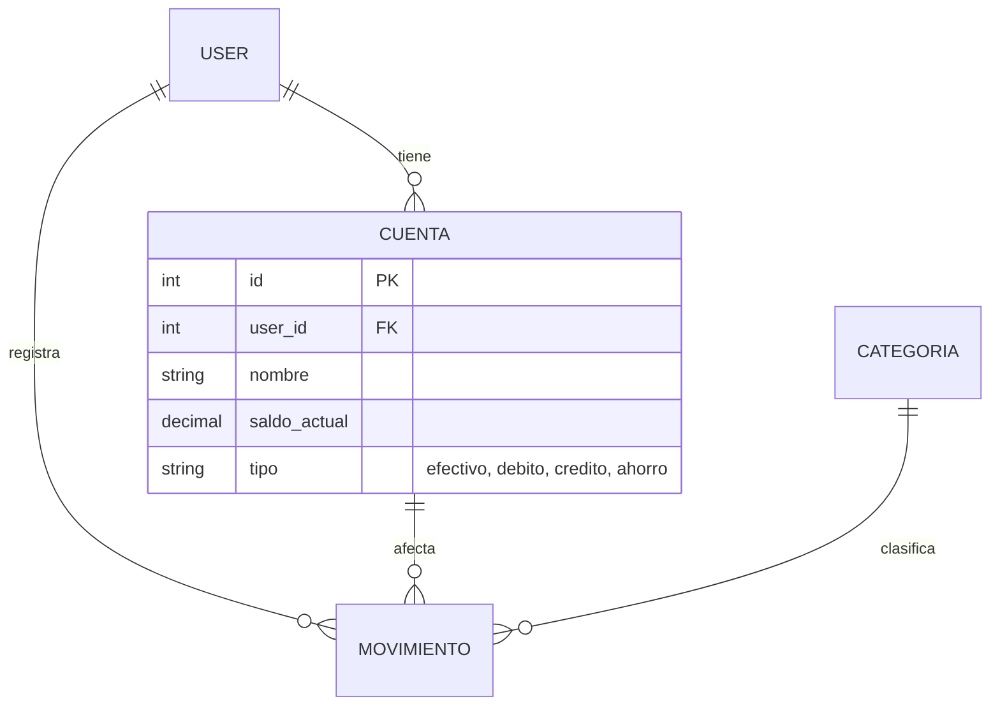

# Análisis del Proyecto: Finanzas Personales (Filament + Laravel)

Este documento presenta un análisis forense y de arquitectura del proyecto de gestión de **Finanzas Personales** basado en Laravel y Filament. Además, se proponen mejoras específicas, estructuradas y listas para implementarse, diseñadas para elevar el proyecto a un nivel premium y robusto.

---

## 📊 1. Arquitectura y Estado Actual del Proyecto

El sistema es una aplicación de administración financiera personal desarrollada con **Laravel 11** y **Filament v3**. Los componentes clave identificados son:

### Modelos y Estructura de Datos
*   **`User`**: Representa al usuario del sistema.
*   **`Categoria`**: Clasificaciones globales para transacciones (`ingreso` o `gasto`).
*   **`Movimiento`**: Transacciones financieras asociadas a un usuario, una categoría y una fecha. Contiene montos, descripciones formateadas en texto enriquecido (RichEditor) y soporte para archivos/fotos de comprobantes de pago.
*   **`Presupuesto`**: Límites de gasto mensuales asignados por categoría y usuario.

### Lógica de Negocio Destacada (Booted Hooks)
*   El modelo [Movimiento.php](file:///c:/Users/coron/Documents/finanzasPersonales/app/Models/Movimiento.php) cuenta con eventos Eloquent robustos (`saved` y `deleted`) que **recalculan automáticamente** el `monto_gastado` en el presupuesto mensual del usuario para la categoría afectada.
*   Si el gasto acumulado supera el presupuesto asignado, el sistema dispara automáticamente una **Notificación Persistente de Filament** (`Filament\Notifications\Notification`), advirtiendo al usuario de forma proactiva con el monto exacto del excedente.

### Panel de Control (Widgets en el Dashboard)
1.  **`StatsOverview`**: Tarjetas ejecutivas que muestran de forma inmediata los ingresos del mes, los gastos del mes y el balance general (Ingresos - Gastos), junto con el presupuesto asignado total.
2.  **`IngresosGastosChart`**: Una gráfica lineal expandida a ancho completo (`columnSpan = 'full'`) que despliega el flujo de caja histórico de los últimos 6 meses (Ingresos vs Gastos).
3.  **`PresupuestosChart`**: Una gráfica de barras a ancho completo que contrasta visualmente el presupuesto asignado contra el monto gastado real para todas las categorías del mes corriente.

---

## 🛠️ 2. Propuesta de Mejoras Prioritarias

Para transformar esta aplicación en un producto SaaS real, seguro, visualmente deslumbrante y funcionalmente completo, se proponen las siguientes mejoras divididas en cuatro ejes principales:



---

### 🛡️ Eje A: Seguridad y Aislamiento Multiusuario (Multi-tenant Isolation)

> [!IMPORTANT]
> **Prioridad Alta.** Actualmente, el sistema actúa como un panel multiusuario abierto: cualquier usuario que inicia sesión puede ver, editar o eliminar los movimientos, presupuestos y categorías de otros usuarios en el panel. Además, el selector de usuario está expuesto en los formularios.

#### 1. Filtrado Automático por Usuario Autenticado
Debemos asegurar que cada usuario visualice únicamente su propia información. Esto se logra modificando las consultas base (`Eloquent Query`) de los recursos de Filament:

```php
// En MovimientoResource.php y PresupuestoResource.php
public static function getEloquentQuery(): Builder
{
    return parent::getEloquentQuery()->where('user_id', auth()->id());
}
```

#### 2. Auto-asignación de Usuario en Creación
En lugar de mostrar un desplegable con todos los usuarios del sistema, el `user_id` debe asignarse de forma transparente tras bambalinas utilizando la sesión actual:

```php
// Ocultar el selector y asignar el valor automáticamente
Forms\Components\Hidden::make('user_id')
    ->default(auth()->id()),
```

#### 3. Categorías Híbridas (Globales + Personalizadas)
Actualmente, las categorías son globales. Si un usuario crea una categoría como *"Suscripción de Anime"*, la verán todos los demás. Si otro usuario la edita o elimina, alterará los datos ajenos.
*   **Solución**: Agregar `user_id` (nullable) a la tabla `categorias`.
*   Las categorías con `user_id = null` serán del sistema (ej: *Comida, Transporte, Nómina*).
*   Las categorías con `user_id = auth()->id()` serán creadas por el usuario y solo visibles para él.

---

### 💳 Eje B: Nueva Estructura Financiera (Cuentas y Metas)

> [!TIP]
> En la vida real, el dinero no flota en el aire; se almacena en diferentes lugares. Añadir soporte para **Cuentas/Monederos** y **Metas de Ahorro** incrementará drásticamente la utilidad de la aplicación.

#### 1. Cuentas o Métodos de Pago
Permite al usuario clasificar sus transacciones según el origen/destino del dinero (Efectivo, Tarjeta de Crédito BBVA, Cuenta de Nómina, etc.).



*   **Lógica Automatizada**: Al registrar un ingreso, se incrementa el `saldo_actual` de la cuenta asociada. Al registrar un gasto, se descuenta.

#### 2. Módulo de Metas de Ahorro
Un panel interactivo para que el usuario guarde dinero para objetivos específicos (ej. *"Viaje a Japón 2027"*, *"Fondo de Emergencias"*, *"Enganche de Auto"*).
*   **Tabla `metas_ahorro`**: `nombre`, `monto_objetivo`, `monto_actual`, `fecha_limite`, `user_id`.
*   **Funcionalidad**: Los usuarios pueden realizar transacciones especiales de tipo "ahorro" que transfieren fondos de una de sus Cuentas a su Meta de Ahorro, incrementando el monto actual.

---

### ✨ Eje C: Pulido Visual y UX Premium (Aesthetics & Interface)

> [!NOTE]
> Una interfaz sofisticada genera mayor retención y engagement. El panel de Filament actual se beneficia enormemente si se le agregan componentes visuales interactivos y formativos.

#### 1. Badges Dinámicos de Tipo de Movimiento
En [MovimientoResource.php](file:///c:/Users/coron/Documents/finanzasPersonales/app/Filament/Resources/MovimientoResource.php#L88-L91), el tipo se renderiza en texto simple. Al transformarlo a insignias de color, la lectura del flujo de caja es inmediata:

```php
Tables\Columns\TextColumn::make('tipo')
    ->label('Tipo de movimiento')
    ->badge()
    ->color(fn (string $state): string => match ($state) {
        'ingreso' => 'success', // Verde esmeralda elegante
        'gasto' => 'danger',    // Rojo carmín suave
    })
    ->icon(fn (string $state): string => match ($state) {
        'ingreso' => 'heroicon-m-arrow-trending-up',
        'gasto' => 'heroicon-m-arrow-trending-down',
    })
    ->searchable()
    ->sortable(),
```

#### 2. Formato de Moneda Localizado
Actualmente, los campos de `monto` se visualizan como simples números decimales (`1500.00`). Podemos aplicar el formateador de monedas localizado de Filament:

```php
Tables\Columns\TextColumn::make('monto')
    ->money('MXN') // Formatea a $1,500.00 pesos mexicanos
    ->sortable(),
```

#### 3. Barra de Progreso Visual de Presupuestos
En la tabla de Presupuestos, ver dos números es aburrido. ¡Podemos agregar una columna que dibuje dinámicamente una **Barra de Progreso** o un indicador de porcentaje en base al nivel de gasto actual!

```php
Tables\Columns\TextColumn::make('progreso')
    ->label('% Consumido')
    ->state(function (Presupuesto $record): string {
        if ($record->monto_asignado <= 0) return '0%';
        $pct = ($record->monto_gastado / $record->monto_asignado) * 100;
        return number_format($pct, 0) . '%';
    })
    ->badge()
    ->color(fn ($state) => 
        (intval($state) >= 100) ? 'danger' : 
        ((intval($state) >= 80) ? 'warning' : 'success')
    ),
```

---

### ⏳ Eje D: Automatización y Reportes

#### 1. Exportación Inteligente
Implementar acciones de exportación directa a Excel o PDF en la tabla de Movimientos, permitiendo generar estados de cuenta mensuales descargables con un solo clic.

#### 2. Gastos Recurrentes (Suscripciones)
Un programador de transacciones para registrar de manera automática los cargos mensuales recurrentes (como Netflix, Internet o Renta).
*   **Tabla `suscripciones`**: `nombre`, `monto`, `dia_pago`, `categoria_id`, `cuenta_id`, `user_id`.
*   Un comando Artisan ejecutándose diariamente a través de `Laravel Scheduler` que verifique si el día actual coincide con el `dia_pago` y cree el correspondiente `Movimiento` de tipo `gasto` sin intervención manual.

---

## 📈 3. Plan de Ruta para la Implementación

Recomendamos seguir este orden estratégico para implementar las mejoras de forma segura sin romper la lógica actual:

| Fase | Título | Descripción | Impacto | Dificultad |
| :--- | :--- | :--- | :---: | :---: |
| **Fase 1** | **Embellecimiento y UX** | Badges de color, iconos, moneda formateada y columna de progreso en presupuestos. | Alta | Muy Baja |
| **Fase 2** | **Seguridad y Aislamiento** | Ocultar y rellenar `user_id` de forma automática, filtrar recursos de Filament por `auth()->id()`. | Crítica | Baja |
| **Fase 3** | **Multicuentas y Balances** | Tabla de `cuentas`, relaciones, actualización de balances en tiempo real mediante Eloquent Triggers. | Alta | Media |
| **Fase 4** | **Metas y Ahorro** | Tabla de `metas_ahorro`, vistas gráficas de progreso y transferencias a metas. | Alta | Media |
| **Fase 5** | **Suscripciones y Reportes** | Tareas programadas (Scheduler), exportación de PDF con estado de cuenta mensual. | Media | Alta |

---

> [!NOTE]
> **¿Qué te parece este análisis?**
> Podemos empezar **inmediatamente** con la **Fase 1** para embellecer completamente la interfaz de usuario en menos de 5 minutos, o bien entrar de lleno a la **Fase 2** para hacer el sistema completamente multiusuario seguro. Dime qué mejora te gustaría implementar primero y nos ponemos a codificar.
